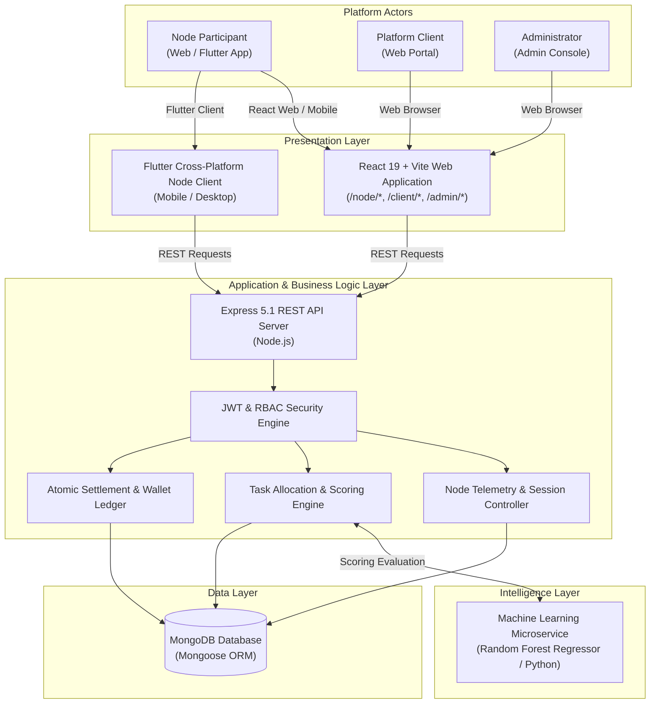
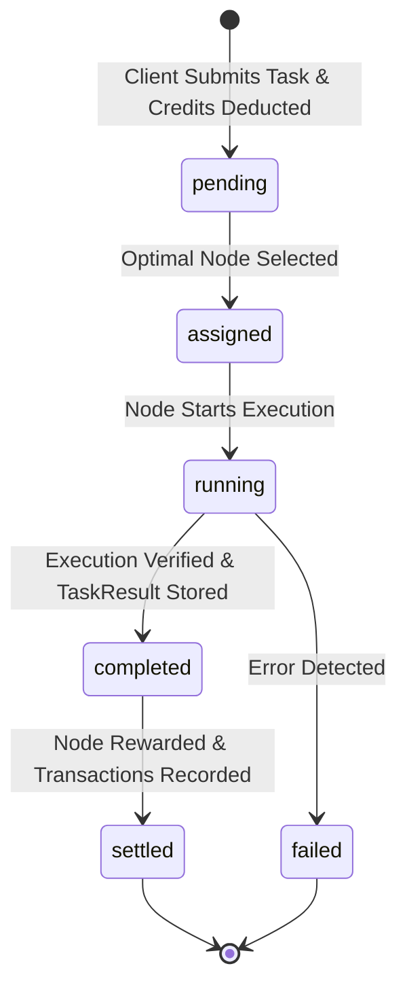

# 🌐 NetShare — Decentralized Internet Bandwidth Sharing Platform

[](https://nodejs.org/)
[](https://expressjs.com/)
[](https://www.mongodb.com/)
[](https://react.dev/)
[](https://vitejs.dev/)
[](https://python.org/)
[](https://flutter.dev/)

---

## 📌 Table of Contents

- [Project Overview](#-project-overview)
- [System Architecture](#-system-architecture)
- [User Roles & Ecosystem](#-user-roles--ecosystem)
- [Core Technology Stack](#-core-technology-stack)
- [Repository Structure](#-repository-structure)
- [Key Modules & Features](#-key-modules--features)
  - [1. Node Participant Ecosystem (Web & Mobile)](#1-node-participant-ecosystem-web--mobile)
  - [2. Platform Client Testing Suite](#2-platform-client-testing-suite)
  - [3. System Administrator Portal](#3-system-administrator-portal)
  - [4. Task Allocation & Weighted Node Scoring](#4-task-allocation--weighted-node-scoring)
  - [5. Machine Learning Ranking Microservice](#5-machine-learning-ranking-microservice)
  - [6. Credit Wallet & Atomic Settlement](#6-credit-wallet--atomic-settlement)
- [API Route Reference (`/api/node`)](#-api-route-reference-apinode)
- [Database Schema & Collections](#-database-schema--collections)
- [Local Setup & Installation](#-local-setup--installation)
  - [1. Backend Setup](#1-backend-setup)
  - [2. Frontend Setup](#2-frontend-setup)
  - [3. ML Service Setup](#3-ml-service-setup)
  - [4. Flutter Client App](#4-flutter-client-app)
- [Environment Variables](#-environment-variables)
- [Testing Checklist](#-testing-checklist)
- [FYP Defense Notes & Architectural Rationale](#-fyp-defense-notes--architectural-rationale)
- [Limitations & Future Scope](#-limitations--future-scope)

---

## 🚀 Project Overview

**NetShare** is a controlled distributed internet testing and bandwidth utilization platform designed as a modern alternative to centralized testing farms and unrestricted residential proxies.

Unlike generic proxy or VPN services that expose residential connections to unvetted external traffic, NetShare is a **controlled, audited testing network**:
- Nodes execute **only approved, platform-validated testing tasks** (Ad Verification, Accessibility Testing, Localization Verification, and Performance Audits).
- Tasks are validated and rate-limited by the central backend before routing.
- Device boundaries (daily bandwidth quotas, upload/download speed caps, maximum concurrent tasks) are strictly enforced at the node level.
- Node contributors are rewarded with platform credits that can be redeemed for software tools, subscriptions, and services in the internal marketplace.

---

## 🏗 System Architecture



---

## 👥 User Roles & Ecosystem

| Role | Target Interface | Core Responsibilities |
| :--- | :--- | :--- |
| **Node Participant** (`node_participant`) | Web (`/node/dashboard`) & Flutter Client | Registers devices, configures bandwidth/speed caps, starts participation sessions, executes tasks, tracks real-time telemetry, and earns credits. |
| **Platform Client** (`platform_client`) | Web (`/client/dashboard`) | Submits web testing jobs (Ad verification, Accessibility, Localization, Performance), deposits credits, and inspects verified results. |
| **Both** (`both`) | Web (`/node/*` and `/client/*`) | Hybrid user who both contributes bandwidth as a node and commissions testing tasks as a client. |
| **System Administrator** (`admin`) | Web (`/admin/dashboard`) | Manages users, inspects fleet nodes, reviews platform tasks, manages credit transactions, and controls marketplace inventory/orders. |

---

## 💻 Core Technology Stack

- **Backend**: Node.js, Express.js 5.1, MongoDB, Mongoose 8, JSON Web Tokens (JWT), Bcrypt password hashing.
- **Frontend**: React 19, Vite 8, React Router v7, Axios with Bearer Interceptors, Context API (`AuthContext`), Lucide React.
- **Machine Learning**: Python 3.9+, Scikit-Learn (Random Forest Regressor), Joblib, Flask REST API.
- **Mobile Client**: Flutter 3.11+, Dart, `http`, `shared_preferences`.
- **Database**: MongoDB (Local or Atlas cloud).

---

## 📂 Repository Structure

```
NetshareCode/
├── README.md                      # Complete Project Documentation (This file)
│
├── netshare-backend/              # Express REST API
│   ├── config/db.js               # MongoDB connection handler
│   ├── controllers/
│   │   ├── adminController.js     # Admin oversight & moderation
│   │   ├── authController.js      # User registration, OTP hashing, JWT login
│   │   ├── marketplaceController.js# Products catalog & order fulfillment
│   │   ├── nodeController.js      # Canonical /api/node controller
│   │   ├── sessionController.js   # Session lifecycle
│   │   ├── taskController.js      # Task creation, lifecycle, atomic settlement
│   │   ├── userController.js      # Profile details & password changes
│   │   └── walletController.js    # Wallet balances & ledger transactions
│   ├── middleware/
│   │   ├── authMiddleware.js      # JWT verification middleware
│   │   └── roleMiddleware.js      # Role-based access control (RBAC)
│   ├── models/
│   │   ├── AdminLog.js            # Audit trail
│   │   ├── CreditTransaction.js   # Immutable financial ledger
│   │   ├── MarketplaceOrder.js    # Order state
│   │   ├── MarketplaceProduct.js  # Store catalog
│   │   ├── NodeDevice.js          # Hardware profile & speed caps
│   │   ├── ParticipationSession.js# Active node uptime session
│   │   ├── TaskResult.js          # Immutable test execution results
│   │   ├── TaskSession.js         # Per-task execution tracking
│   │   ├── TestingTask.js         # Client submitted testing tasks
│   │   ├── User.js                # Core user account & OTPs
│   │   └── Wallet.js              # User balance ledger
│   ├── routes/
│   │   ├── nodeRoutes.js          # /api/node/* endpoints
│   │   ├── authRoutes.js          # /api/auth/* endpoints
│   │   ├── taskRoutes.js          # /api/tasks/* endpoints
│   │   ├── walletRoutes.js        # /api/wallet/* endpoints
│   │   ├── marketplaceRoutes.js   # /api/marketplace/* endpoints
│   │   └── adminRoutes.js         # /api/admin/* endpoints
│   ├── services/
│   │   ├── taskAllocationService.js # Weighted multi-factor node ranking
│   │   └── walletService.js       # Atomic credit adjustment engine
│   ├── package.json
│   └── server.js                  # Entry point (canonical /api/node route)
│
├── netshare-frontend/             # React 19 + Vite Web Application
│   ├── src/
│   │   ├── api/                   # Axios API service clients (nodeApi.js, authApi.js, etc.)
│   │   ├── components/common/     # LoadingSpinner, ErrorMessage, StatusBadge, StatsCard
│   │   ├── context/AuthContext.jsx# Central authentication state
│   │   ├── layouts/
│   │   │   ├── NodeLayout.jsx     # Dedicated Node Participant sidebar & topbar
│   │   │   ├── ClientLayout.jsx   # Client portal layout
│   │   │   └── AdminLayout.jsx    # Administrator portal layout
│   │   ├── pages/
│   │   │   ├── node/              # Node Participant Module:
│   │   │   │   ├── NodeDashboard.jsx     # Participation state, meters, active tasks
│   │   │   │   ├── NodeParticipation.jsx # Start/stop controls & speed limits
│   │   │   │   ├── NodeSession.jsx       # 5s polling session monitor & task runner
│   │   │   │   └── NodeWallet.jsx        # Earnings, balance & ledger
│   │   │   ├── client/            # Client Dashboard, SubmitTask, MyTasks, Wallet
│   │   │   ├── admin/             # Admin Dashboard, ManageUsers, Fleet, Tasks
│   │   │   ├── auth/              # Login, Register, OTP verification, Reset Password
│   │   │   └── LandingPage.jsx    # Marketing landing page
│   │   ├── routes/AppRoutes.jsx   # Role-protected routing
│   │   └── App.jsx
│   └── package.json
│
├── ml-service/                    # Machine Learning Node Ranking Engine
│   ├── nodeRanking.py             # Random Forest Regressor & evaluation
│   ├── app.py                     # Flask REST microservice (/predict-score, /rank-nodes)
│   ├── requirements.txt           # Python dependencies
│   └── README.md                  # Model documentation
│
└── Netshare/netshare_node_app/    # Flutter Cross-Platform Client
```

---

## ⚡ Key Modules & Features

### 1. Node Participant Ecosystem (Web & Mobile)
- **Node Onboarding**: Guided hardware registration capturing device fingerprint, region, daily bandwidth quota (MB), and upload/download speed caps (Mbps).
- **Session Control**: Interactive **Start Participation** and **Stop Participation** with live visual state indicators.
- **Real-Time Telemetry Monitor (`NodeSession.jsx`)**: Active 5-second polling displaying connected duration (HH:MM:SS), current ping/latency (ms), simulated packet loss, network quality status (Excellent / Good / Fair / Poor), and live credit accrual.
- **In-Browser Task Execution Simulation**: When a task is allocated, the node participant can trigger simulated test execution (`startTaskExecution` $\rightarrow$ `completeTaskExecution`), measure latency, verify results, and trigger immediate wallet settlement.
- **Node Wallet & Ledger**: Transparent credit balance overview, today's earnings, lifetime rewards, and detailed transaction ledger.

### 2. Platform Client Testing Suite
- **Task Submission Wizard**: Multi-category task dispatcher:
  1. *Ad Verification*: Confirm ad visibility and detect domain spoofing across regional nodes.
  2. *Accessibility Testing*: Verify accessibility compliance from residential connections.
  3. *Localization Testing*: Check geo-specific pricing, currency, language, and assets.
  4. *Performance Testing*: Measure real-world latency, page load speed, and network response.
- **Automated Cost Calculation**: Computes credit costs dynamically based on service category and execution limit.

### 3. System Administrator Portal
- **Fleet Oversight**: Inspect active nodes, bandwidth utilization, latency, and reliability scores.
- **User Governance**: One-click user blocking/unblocking with instant session invalidation.
- **Audit Trails**: Security and administrative action logs stored in `AdminLog`.

---

### 4. Task Allocation & Weighted Node Scoring

To guarantee optimal task routing without relying on naive round-robin matching, NetShare employs a composite multi-factor scoring formula:

$$\text{Node Score} = 0.40 \times \text{Reliability} + 0.25 \times \text{LatencyScore} + 0.20 \times \text{BandwidthAvailability} + 0.15 \times \text{RegionMatch}$$

#### Scoring Rationale:
- **Negative Latency Inversion**: Latency is strictly a negative indicator. Instead of adding raw latency, we invert and normalize:
  $$\text{LatencyScore} = 1 - \min\left(1, \frac{\text{latencyMs}}{500}\right)$$
  *(A node with 20ms ping scores $\approx 0.96$, while a node with 400ms ping scores $0.20$)*.
- **Bandwidth Availability**: Ratio of remaining quota over configured limit:
  $$\text{BandwidthAvailability} = \frac{\text{bandwidthLimitMB} - \text{usedBandwidthMB}}{\text{bandwidthLimitMB}}$$
- **Region Match**:
  - Exact regional match: $1.0$
  - Global / Universal node: $0.7$
  - Mismatch fallback: $0.1$
- **Capacity Gate**: Only active nodes with $\text{currentActiveTasks} < \text{maxConcurrentTasks}$ and remaining bandwidth are evaluated.

---

### 5. Machine Learning Ranking Microservice

In `ml-service/`, a **Random Forest Regressor** predicts node suitability from operational telemetry:
- **Input Features**: `[latency, bandwidth, reliability, successRate]`
- **Output**: Continuous Suitability Score $\in [0.0, 1.0]$
- **Microservice Endpoints**:
  - `POST /predict-score`: Evaluates a single node profile.
  - `POST /rank-nodes`: Ranks an array of candidate nodes and returns them sorted by suitability.
- **Portability Guarantee**: Includes a pure Python analytical regression fallback so the system remains fully operable even if heavy ML libraries are not yet installed in the target environment.

---

### 6. Credit Wallet & Atomic Settlement

The task lifecycle follows a secure, audited transition sequence:



#### Atomic Settlement Guarantees:
1. **Immutable Result Record**: Creates a `TaskResult` document capturing latency, packet loss, bandwidth consumed, status code, and payload.
2. **Reward Disbursement**: Disburses 70% of task cost to node participant's wallet.
3. **Double Ledgering**: Generates corresponding `CreditTransaction` records.
4. **Rollback Protection**: If credit settlement encounters an exception, task state reverts and an audit incident is recorded in `AdminLog`.

---

## 📡 API Route Reference (`/api/node`)

| Method | Canonical Endpoint | Role Required | Description |
| :--- | :--- | :--- | :--- |
| `GET` | `/api/node/dashboard` | `node_participant`, `both`, `admin` | Fetches aggregated dashboard metrics, bandwidth meters, earnings, and device info. |
| `POST` | `/api/node/start` | `node_participant`, `both`, `admin` | Starts participation session and sets node status to `active`. |
| `POST` | `/api/node/stop` | `node_participant`, `both`, `admin` | Stops active session, records end time, and marks node `inactive`. |
| `PUT` | `/api/node/settings` | `node_participant`, `both`, `admin` | Updates `bandwidthLimitMB`, `uploadSpeedCapMbps`, `downloadSpeedCapMbps`, `maxConcurrentTasks`, and `region`. |
| `GET` | `/api/node/session/current` | `node_participant`, `both`, `admin` | Real-time session telemetry (duration, ping, packet loss, network quality, assigned task). |
| `GET` | `/api/node/transactions` | `node_participant`, `both`, `admin` | Returns node participant credit earning history and balance. |
| `POST` | `/api/node/register` | `node_participant`, `both`, `admin` | Registers a new hardware node for the user. |
| `GET` | `/api/node/my-node` | `node_participant`, `both`, `admin` | Retrieves existing node profile. |
| `GET` | `/api/node/assigned-task` | `node_participant`, `both`, `admin` | Fetches currently assigned testing task. |

*(Note: `/api/nodes` is aliased in the backend for full backwards compatibility).*

---

## 🗄 Database Schema & Collections

### 1. `NodeDevice`
- `userId`: ref `User`
- `deviceName`: String
- `deviceId` & `deviceFingerprint`: String
- `region`: String (`US-East`, `EU-Central`, etc.)
- `status`: Enum (`active`, `inactive`, `paused`, `busy`)
- `bandwidthLimitMB`: Number (Daily quota)
- `usedBandwidthMB`: Number
- `uploadSpeedCapMbps`: Number
- `downloadSpeedCapMbps`: Number
- `maxConcurrentTasks`: Number
- `currentActiveTasks`: Number
- `reliabilityScore`: Number ($0-100$)
- `successRate`: Number ($0-100$)
- `latencyMs`: Number
- `lastSeenAt`: Date

### 2. `ParticipationSession`
- `sessionId`: String (Unique session identifier)
- `userId`: ref `User`
- `deviceId`: ref `NodeDevice`
- `status`: Enum (`active`, `stopped`, `paused`)
- `startTime` & `endTime`: Date
- `bandwidthUsed`: Number
- `latency`: Number
- `packetLoss`: Number
- `networkQuality`: Enum (`Excellent`, `Good`, `Fair`, `Poor`)
- `activeTasksCount`: Number
- `creditsEarned`: Number

### 3. `TaskResult` (New Immutable Model)
- `taskId`: ref `TestingTask`
- `nodeId`: ref `NodeDevice`
- `clientId`: ref `User`
- `nodeUserId`: ref `User`
- `serviceType`: String
- `targetUrl`: String
- `success`: Boolean
- `successRate`: Number
- `latencyMs`: Number
- `packetLoss`: Number
- `bandwidthUsedMB`: Number
- `statusCode`: Number
- `resultData`: Mixed Object
- `completedAt`: Date

### 4. `TestingTask`
- `clientId`: ref `User`
- `targetUrl`: String
- `serviceType`: Enum (`ad_verification`, `accessibility_testing`, `localization_testing`, `performance_testing`)
- `targetRegion`: String
- `executionLimit`: Number
- `estimatedCost`: Number
- `assignedNodeId`: ref `NodeDevice`
- `status`: Enum (`pending`, `assigned`, `running`, `completed`, `failed`, `settled`, `cancelled`)
- `resultSummary`: Object

---

## 🛠 Local Setup & Installation

### 1. Backend Setup
```bash
cd netshare-backend
npm install
npm run dev
```
Backend runs on `http://localhost:8000`.

### 2. Frontend Setup
```bash
cd netshare-frontend
npm install
npm run dev
```
Frontend runs on `http://localhost:5173`.

### 3. ML Service Setup
```bash
cd ml-service
python nodeRanking.py   # Runs benchmark test
python app.py           # Starts REST microservice on port 5001
```

### 4. Flutter Client App
```bash
cd Netshare/netshare_node_app
flutter pub get
flutter run -d chrome   # or -d windows / android
```

---

## ⚙ Environment Variables

### Backend (`netshare-backend/.env`)
```env
PORT=8000
MONGO_URI=mongodb://localhost:27017/netshare_db
JWT_SECRET=netshare_phase_one_secret
NODE_ENV=development
```

### Frontend (`netshare-frontend/.env`)
```env
VITE_API_BASE_URL=http://localhost:8000/api
```

---

## ✅ Testing Checklist

### 1. Authentication & Roles
- [x] Register new user as `node_participant`.
- [x] Register new user as `platform_client`.
- [x] Login as `node_participant` $\rightarrow$ automatically redirected to `/node/dashboard`.
- [x] Login as `platform_client` $\rightarrow$ automatically redirected to `/client/dashboard`.
- [x] Login as `admin` $\rightarrow$ automatically redirected to `/admin/dashboard`.
- [x] Unauthenticated access to `/node/*` redirects to `/login`.
- [x] Non-admin accessing `/admin/*` denied with RoleRoute protection.

### 2. Node Participant Module
- [x] Node Registration: Prompted to register device if none exists.
- [x] Start Participation: Status switches to `ACTIVE` with glowing badge.
- [x] Stop Participation: Session marks end time and status updates to `INACTIVE`.
- [x] Settings Configuration: Update daily limit, speed caps, and region; verify validation prevents invalid bounds.
- [x] Session Telemetry: Connected timer ticks, latency and packet loss display, 5s polling functions smoothly.
- [x] Task Runner: Run assigned task $\rightarrow$ executes, settles, and rewards credits.
- [x] Node Wallet: Shows updated credit balance, today's earnings, and audit transaction records.

### 3. Task Lifecycle & Allocation
- [x] Client submits task with target URL and region.
- [x] Client wallet credits deducted upon creation.
- [x] Multi-factor node ranking algorithm matches the highest scoring eligible node.
- [x] Node completes task $\rightarrow$ status moves to `completed` $\rightarrow$ `settled`.
- [x] Immutable `TaskResult` document stored in MongoDB.
- [x] Node participant wallet credited with 70% reward.

---

## 🎓 FYP Defense Notes & Architectural Rationale

When defending NetShare before your FYP examination committee:

1. **Why is NetShare NOT a VPN or Open Proxy?**
   - *Defense Point*: Standard proxies allow arbitrary, unauthenticated egress traffic which poses severe abuse, legal, and ISP violation risks for residential users. NetShare is a **domain-controlled distributed testing harness**: the backend orchestrates and validates tasks against specific testing categories; arbitrary raw proxy tunnels are not permitted.

2. **How is Node Selection Optimized?**
   - *Defense Point*: Rather than naive FIFO or random assignment, we implemented a multi-factor composite suitability algorithm balancing reliability ($40\%$), inverted latency ($25\%$), bandwidth availability ($20\%$), and regional locality ($15\%$). Furthermore, we prepared a standalone **Random Forest Regressor** in Python to demonstrate machine-learning-driven node ranking.

3. **How is Transaction Integrity Maintained?**
   - *Defense Point*: Every task settlement is double-ledgered via `CreditTransaction` models. Deductions on the client side and rewards on the node participant side are explicitly audited. If an error occurs during settlement, the state reverts safely.

---

## 🔮 Limitations & Future Scope

- **Real-Time Tunneling**: Phase 1 implements a controlled simulation and live orchestration layer. Future iterations can integrate a native SOCKS5/WireGuard proxy daemon for live DOM extraction.
- **WebSockets for Instant Push**: Polling is currently used (every 5 seconds) to guarantee maximum stability across all environments without WebSocket disconnection issues. WebSockets (Socket.io) can be introduced for zero-latency bidirectional push.
- **Web3 Payouts**: Direct integration with stablecoin smart contracts (USDC on Polygon/Solana) for automated fiat/crypto conversion.
