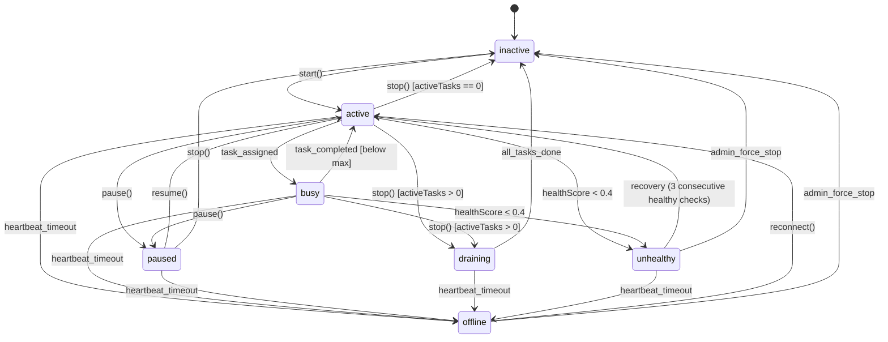

# NetShare Node Lifecycle v1.0

## Node States

## State Definitions

| State | Description | Accepts Tasks? | Heartbeating? |
|---|---|---|---|
| `inactive` | Not participating. Default state after registration. | No | No |
| `active` | Participating and eligible for task assignment. | Yes | Yes |
| `busy` | Participating but at max concurrent tasks. | No (at capacity) | Yes |
| `paused` | Participant requested temporary suspension. | No | Yes |
| `draining` | Stop requested, waiting for active tasks to complete. | No | Yes |
| `offline` | Heartbeat timeout — not reachable. | No | No |
| `unhealthy` | Health score dropped below threshold. | No | Yes |

## Transition Matrix

| From \ To | inactive | active | busy | paused | draining | offline | unhealthy |
|---|---|---|---|---|---|---|---|
| **inactive** | — | ✅ start | ❌ | ❌ | ❌ | ❌ | ❌ |
| **active** | ✅ stop | — | ✅ task | ✅ pause | ✅ stop* | ✅ timeout | ✅ health |
| **busy** | ❌ | ✅ complete | — | ✅ pause | ✅ stop* | ✅ timeout | ✅ health |
| **paused** | ✅ stop | ✅ resume | ❌ | — | ❌ | ✅ timeout | ❌ |
| **draining** | ✅ done | ❌ | ❌ | ❌ | — | ✅ timeout | ❌ |
| **offline** | ✅ admin | ✅ reconnect | ❌ | ❌ | ❌ | — | ❌ |
| **unhealthy** | ✅ admin | ✅ recover | ❌ | ❌ | ❌ | ✅ timeout | — |

\* `stop()` enters `draining` when `activeTasks > 0`, or `inactive` when `activeTasks == 0`

## Lifecycle Operations

### `start()` — Begin Participation

**Trigger**: User clicks "Start" / agent auto-connects  
**Precondition**: `status == inactive`  
**Actions**:
1. Transition node to `active`
2. Close any orphaned active ParticipationSessions
3. Create new ParticipationSession
4. Update `lastSeenAt`

### `stop()` — End Participation

**Trigger**: User clicks "Stop" / admin force-stop  
**Precondition**: `status ∈ {active, busy, paused, draining}`  
**Actions**:
- If `activeTasks == 0`: transition to `inactive`, close session
- If `activeTasks > 0`: transition to `draining`
- If already `draining` and `activeTasks == 0`: transition to `inactive`
- If already `inactive`: idempotent no-op

### `pause()` — Suspend Participation

**Trigger**: User clicks "Pause"  
**Precondition**: `status ∈ {active, busy}`  
**Actions**:
1. Transition to `paused`
2. Node continues heartbeating but receives NO new tasks
3. Active tasks continue running

### `resume()` — Resume After Pause

**Trigger**: User clicks "Resume"  
**Precondition**: `status == paused`  
**Pre-checks**: Bandwidth limit not exhausted  
**Actions**:
1. If `activeTasks > 0`: transition to `busy`
2. If `activeTasks == 0`: transition to `active`

### Task Assignment

**Trigger**: Backend `findAvailableNode()` allocates task  
**Precondition**: `status == active`, `activeTasks < maxConcurrentTasks`, bandwidth not exhausted  
**Actions**:
1. Increment `currentActiveTasks`
2. If `currentActiveTasks >= maxConcurrentTasks`: transition to `busy`
3. Emit task via Socket.IO

### Task Completion

**Trigger**: Node reports task complete/failed  
**Actions**:
1. Decrement `currentActiveTasks`
2. If `status == busy` and `activeTasks < maxConcurrentTasks`: transition to `active`
3. If `status == draining` and `activeTasks == 0`: transition to `inactive`, close session
4. Update bandwidth counters
5. Award credits

### Heartbeat Timeout

**Trigger**: No heartbeat received for 35 seconds  
**Actions**:
1. Transition to `offline`
2. Tasks assigned to this node may be retried/failed

### Health Degradation

**Trigger**: `calculateHealthScore()` returns score < UNHEALTHY (0.4)  
**Actions**:
1. Transition to `unhealthy`
2. No new tasks assigned
3. Continue heartbeating — recovery is possible

### Health Recovery

**Trigger**: `calculateHealthScore()` returns score ≥ RECOVERY (0.5) for 3 consecutive checks  
**Actions**:
1. Transition to `active`
2. Resume task eligibility

## Draining Semantics

When a node has active tasks and the user requests stop:

1. Node enters `draining` state
2. No new tasks are assigned
3. Active tasks continue to completion or timeout
4. When all tasks complete: automatic transition to `inactive`
5. Drain timeout: if tasks don't complete within 5 minutes, force-transition to `inactive` and mark tasks as `failed`

## Idempotency

| Operation | On Repeat | Behavior |
|---|---|---|
| `start()` on `active` | New session | Closes old session, creates new one |
| `stop()` on `inactive` | No-op | Returns "already inactive" |
| `stop()` on `draining` (0 tasks) | Completes drain | Transitions to `inactive` |
| `pause()` on `paused` | Error 400 | "Node must be active or busy" |
| `resume()` on `active` | Error 400 | "Node must be paused" |

## Socket.IO Events

| Event | Direction | Payload |
|---|---|---|
| `heartbeat` | Node → Server | `{ metrics, timestamp }` |
| `heartbeat_ack` | Server → Node | `{ serverTime }` |
| `task_assigned` | Server → Node | `{ taskId, targetUrl, ... }` |
| `task_completed` | Node → Server | `{ taskId, result, bandwidth, latency }` |
| `task_failed` | Node → Server | `{ taskId, reason }` |
| `node_status_change` | Server → Node | `{ status, reason }` |
| `disconnect` | Node → Server | Implicit — triggers timeout |
